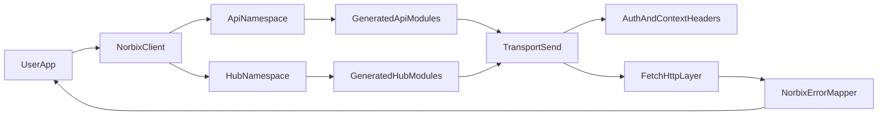

# Norbix TypeScript SDK — Architecture Review and Improvement Plan

> Scope: architecture and developer UX for `@norbix/ts`, based on current source and generated docs.
> Date: 2026-04-28.

This document is the maintainer-facing architecture review for the JS SDK. It separates current implementation facts from improvement proposals and tags each recommendation as `Done`, `Partial`, or `Open`.

---

## 1. Current Architecture

### 1.1 System boundaries

- **Public package and exports:** `package.json` exports `@norbix/ts`, `@norbix/ts/api`, `@norbix/ts/hub`, `@norbix/ts/types/*`.
- **Top-level entrypoint:** `src/index.ts` re-exports `Norbix`, core errors, config helpers.
- **Core handwritten runtime:** `src/client/*` (`Norbix.ts`, `transport.ts`, `errors.ts`, `env.ts`, `types.ts`).
- **Generated API surface:** `src/api/*`, `src/hub/*`, and DTO contracts in `src/types/*`.
- **Tests:** handwritten client behavior in `tests/client.test.ts`; generated endpoint coverage under `tests/api/*` and `tests/hub/*`.

### 1.2 Request lifecycle

1. `new Norbix(config)` merges `config -> env -> defaults` in `src/client/Norbix.ts`.
2. Namespace calls (`norbix.api.*`, `norbix.hub.*`) delegate to `Transport.send`.
3. `Transport` builds URL/path/body (`buildUrlAndBody`), applies auth/context headers, enforces timeout with `AbortController`, executes `fetch`, and maps failures to `NorbixError`.
4. Generated modules contribute endpoint metadata (path template, method, scope, path params) and call the shared transport.

### 1.3 Architecture flow

### 1.4 Current behavior snapshot

- **Auth precedence:** per-call `bearerToken` override -> client bearer token -> API key.
- **Per-call overrides:** `bearerToken` and `timeoutMs` are supported today (`src/client/transport.ts`).
- **Scopes:** account-scoped endpoints throw early when `accountId` is missing.
- **Reliability:** timeout + structured error mapping implemented; retry/backoff and refresh retry are not.
- **Realtime:** webhook management endpoints exist in Hub modules; no SDK-level SSE/event-stream helper module yet.

---

## 2. Current State Assessment

The SDK foundation is solid: clear transport boundary, predictable config/env precedence, typed core errors, generated endpoint breadth, and stable build/test/release tooling.

Primary gaps are in top-layer ergonomics and resilience:

- Generated method signatures overuse `Partial<DTO>`, which weakens compile-time guarantees for required fields.
- Resource-first hand-written APIs (`collection('orders').findAll`, etc.) are absent; call sites are DTO-shaped and verbose.
- Transport has no first-class retry/backoff, `Retry-After`, or 401 refresh workflow.
- Architecture docs and some top-level README claims drifted behind generated coverage and transport behavior.

---

## 3. Recommended Improvements (Status Tagged)

Each item lists status, impact, and evidence.

### 3.1 Config, initialization, and runtime safety

1. **Add config validation for URL/timeouts**  
   - Status: `Open`  
   - Impact: Medium  
   - Evidence: constructor validates `projectId` and `fetch`, but does not validate URL shape in `src/client/Norbix.ts`.

2. **Provide static factories (`Norbix.fromEnv`, `Norbix.create`)**  
   - Status: `Open`  
   - Impact: Low  
   - Evidence: single constructor entrypoint currently.

3. **Redact sensitive fields in config inspection API**  
   - Status: `Open`  
   - Impact: Medium  
   - Evidence: `getConfig()` returns raw resolved config including secrets.

4. **Add client clone/with-scope constructor for SSR request isolation**  
   - Status: `Open`  
   - Impact: High  
   - Evidence: mutable shared config pattern in `Norbix` + `Transport` can leak token changes across request contexts in singleton server usage.

### 3.2 API surface ergonomics and typing

5. **Add a hand-written resource-style API over generated modules**  
   - Status: `Open`  
   - Impact: High  
   - Evidence: primary call site remains endpoint-DTO shaped (`norbix.api.database.find({...})`) without narrow ergonomic layer.

6. **Tighten required-field typing (reduce broad `Partial<DTO>`)**  
   - Status: `Open`  
   - Impact: High  
   - Evidence: many generated methods default to `Partial<DTO>`, allowing runtime-only validation failures.

7. **Add pagination iterator helpers for list/find patterns**  
   - Status: `Open`  
   - Impact: Medium  
   - Evidence: no helper abstraction in client layer; users handle pagination loops manually.

8. **Document subpath imports for targeted consumption**  
   - Status: `Partial`  
   - Impact: Low  
   - Evidence: package export map supports subpaths; examples are limited in top-level docs.

### 3.3 Auth and reliability

9. **Support refresh-token-aware 401 retry flow**  
   - Status: `Open`  
   - Impact: High  
   - Evidence: transport currently returns non-2xx errors directly and does not retry on 401.

10. **Retry/backoff for transient failures (5xx/429 + `Retry-After`)**  
    - Status: `Open`  
    - Impact: High  
    - Evidence: no retry loop in `Transport.send`.

11. **Upgrade hooks to middleware/interceptor chain**  
    - Status: `Open`  
    - Impact: Medium  
    - Evidence: current `onRequest` / `onResponse` are observational callbacks.

12. **Split error types for robust catch patterns**  
    - Status: `Open`  
    - Impact: Medium  
    - Evidence: single `NorbixError` class today.

### 3.4 Generation quality and docs alignment

13. **Remove generated DTO `ts-nocheck` usage**  
    - Status: `Open`  
    - Impact: Medium  
    - Evidence: generated DTO files are not fully type-checked.

14. **Fix path-param casing drift at generator source**  
    - Status: `Open`  
    - Impact: Medium  
    - Evidence: case-insensitive lookup in transport currently masks inconsistent generated key casing.

15. **Per-call token override in transport**  
    - Status: `Done`  
    - Impact: High  
    - Evidence: request options include `bearerToken`/`timeoutMs` override and this is active in transport logic.

16. **Refresh stale coverage/missing-action docs claims**  
    - Status: `Partial`  
    - Impact: Medium  
    - Evidence: generated docs show current coverage; some top-level README wording still reflects old “missing actions” table style.

---

## 4. Prioritized Roadmap (Now / Next / Later)

### Now (high impact, low ambiguity)

1. Retry/backoff + `Retry-After` in transport (`Open`, non-breaking).
2. 401 refresh retry strategy (`Open`, requires explicit token lifecycle design).
3. Required-field typing improvements for generated method signatures (`Open`, potentially breaking for callers that rely on loose inputs).
4. Secret redaction for config introspection API (`Open`, non-breaking if additive API is used).

### Next (ergonomics layer)

1. Resource-style wrappers on top of generated modules.
2. Pagination iterator helpers.
3. Expanded subpath import and runtime-mode examples.

### Later (deeper architecture quality)

1. Middleware chain refactor.
2. Error class hierarchy.
3. Codegen normalization: path param casing, DTO typecheck hardening.

---

## 5. Backward Compatibility and Migration Guidance

- **Potentially breaking items:** stricter request typing (removing broad `Partial<DTO>` defaults), resource wrapper adoption if old names are changed.
- **Recommended release policy:**
  - Additive APIs (`fromEnv`, resource wrappers, pagination helpers) in minor releases.
  - Typing-tightening or signature changes in major release with migration notes and before/after examples.
- **Migration controls:**
  - Keep generated low-level modules available while introducing ergonomic wrappers.
  - Use deprecation notices in docs before removing any old call shapes.

---

## 6. Decision Log

### Accepted in this review

- Keep generated modules as the compatibility baseline.
- Prioritize transport resilience and type safety before broad surface redesign.
- Treat architecture docs as implementation-state references, not static one-time audits.

### Needs maintainer confirmation

- Canonical naming language in docs (`norbix-js` repository vs `@norbix/ts` package references).
- Preferred refresh-token ownership model (SDK-managed vs app-provided callback).
- Major-version timing for strict typing changes.
